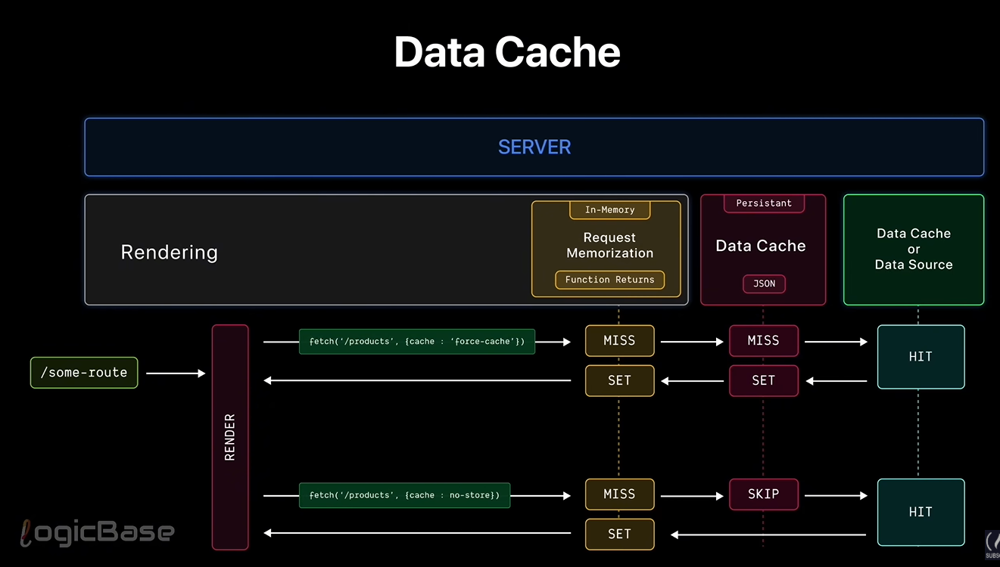
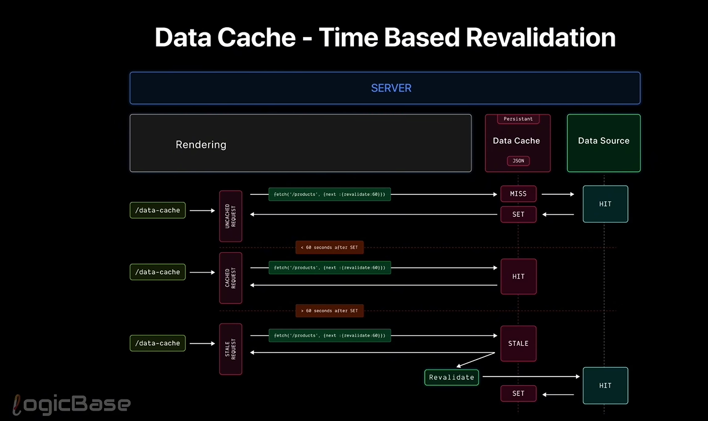
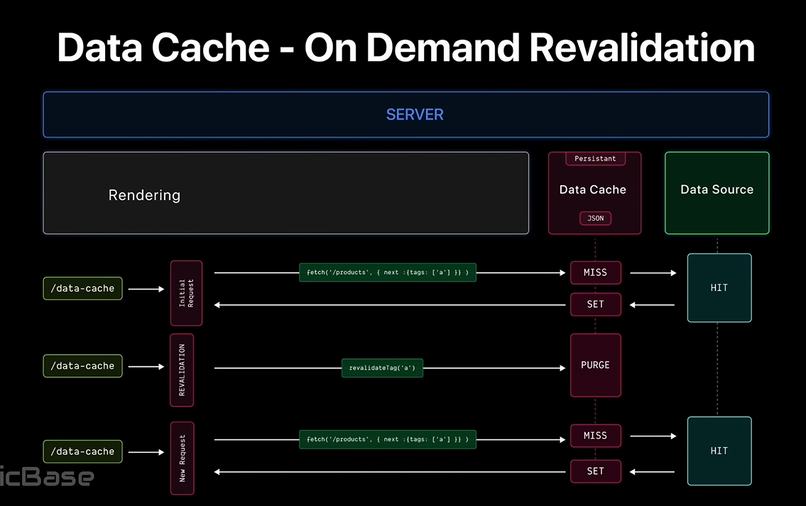

# How Data Cache Works



Data cache works using a simple diagram style explanation. So first of all, this caching happens on the server level. 
Let's imagine our data cache sits right here. It's a persistent layer and it exits outside the rendering phase.
Meaning by the time we reach data cache, rendering is already happening. So data cache is something that happens 
after rendering has begun. Now imagine someone hits a root. This triggers the rendering phase and during this phase some a URL.
If that fetch request is set to force cache, here's what happens. first hits the request memorization layer. Since it's the 
first request, it's a miss because this is an in-memory layer. Then it tries the data cache layer. Again, it's a miss since 
there's no cache data yet. So the request goes to the data source like your database or API. Once the data comes back from 
the source, it is first stored in the data cache layer so it can persist beyond this render. Then it's stored in the request 
memorization layer. So other parts of this same render can reuse it. Finally, the client receives the response for subsequent
requests within the same render. Data is fetched directly from the request memorization layer. Super fast, no need to refetch 
or go to the database again. But what if you used cache no store in the fetch request? In that case, first it will miss the 
request memorization layer. But when it reaches the data cache layer, it won't even try. It's a skip, not a miss because you 
explicitly told it not to use any cache. The request goes straight to the data source. Once the data comes back, it's stored 
only in the request memorization layer and skips the data cache layer completely. Then it's returned to the client. So this is 
how data cache operates behind the scenes. 


# Time based revalidation



At how time based revalidation flow actually works through a diagram. This also happens entirely on the server side and outside 
the rendering phase. So here we have our data cache and here we have our data source. Now imagine someone hits a root. 
If it's an uncached request meaning the very first request, what happens? Let's say someone makes a request and in the 
next revalidate property we have set it to 60 seconds. So what happens first is it will obviously be a cache maze. Then 
it hits the data source. Once it fetches the data, it sets the data inside the data cache. And at that moment, the client 
who made that first uncashed request, they get their response. Now if any subsequent requests come within those 60 seconds, 
those will be considered cached requests. In that case, we directly serve the data from the data cache. That is we respond 
from there. But if someone makes a request after those 60 seconds are over, then that request is no longer cached.
It's considered a stale request. This first stale request is what we call stale while revalidate. Which means until
revalidation completes, the client will be shown the stale data. Now, even though you have called the revalidate function for 
this stale request, it takes a bit of time to execute. So during that time, the client will still get the stale data. 
Once that ST request is responded to, the revalidation continues in the background. After revalidation finishes, it hits 
the data source again, fetches the updated data and sets it back to the data cache. From that point on, any incoming   
will again get the data from the updated data cache. And this flow keeps repeating for every user.

    ## What is stale request
        A request that is served using old (cached) data because the cache has expired or been marked for revalidation,
        but fresh data has not been generated yet

    #### 1️⃣ What “stale” means

        Stale = outdated but still usable

    #### In Next.js caching:

        **Data is cached**

        **After a certain time (revalidate) or event (revalidatePath, revalidateTag)**

        **The cached data becomes stale**

        But Next.js does NOT immediately block the request.


    #### Stale-While-Revalidate

        1. User requests a page

        2. Cache exists but is stale

        3. ✅ User gets the old data immediately

        4. 🔄 Next.js starts regenerating fresh data in the background

        5. Next request gets the updated data


## Revalidating cache on-demand



On demand revalidation works in the case of data cache. When the first request comes in, meaning the initial request,
we make that request with a tag. Let's say the tag is a this request will hit the data cache. And since it's the first time,
it will miss. Then it will hit the data source, fetch the data, return the response, set it in the data cache, and send the 
response back to the client. After that, all the subsequent requests will get data directly from the data cache. 
When we call the revalidate function, we actually call the revalidate tag function. At that point, this data cache gets purged.
Meaning it gets cleared. Later when a new request comes in, since the cache has been purged, it will miss again. Then it will 
hit the data source. Fetch the data, set it in the cache, and in the next requests, the cache will be hit This is how we do 
the on demand revalidation process.

    ## Purged 
        It deletes (purges) the old cache, and the NEXT request creates a new cache.

# Using 3W&3H method:

| Strategy              | What                          | Where              | Why                     | How long     | How to refresh | How to cancel                      |
|-----------------------|-------------------------------|----------------------------------------------|--------------|----------------|------------------------------------|
| Data Cache            | Memoize any server-side fetch | local/edge/custom  | minimized network calls | persistent   |time-based or   |                                    |
|                       |                               | storage server     | & increase performance  | even across  | on demand      |        {cache:"no-store"}          |
|                       |                               | side               |                         | deployments  | revalidation   |                                    |


# Points to remember

1. Data cache is not a feature of React. It's a feature of Nex.js. And NexJS is able to do this because it overrides the browser's 
default fetch API which is why you are able to use options like next revalidate zero inside fetch. These options are not 
available in the built-in fetch function. NextJS overrides the fetch function to implement these features. By interfering here, 
it ultimately applies its own caching strategy, data cache. 

2. Is just like request memorization, data cache also works only for get requests. It doesn't work for post, put, patch
or delete requests.

3. The third thing is it's different from request memorization. In request memorization, I told you that it only works 
inside the React tree and nowhere else. For example, in route handlers, request memorization doesn't work. But data 
cache works for any fetch request on the server side even outside rendering. So if you use it inside route handlers,
data cache will still be applied there. But in the case of middleware, the rule is different. No fetch request cached 
in nextJS middleware. Always remember this.

4. And the final point I want to mention which is very important is that data cache actually performs differently in dev mode.
Many people don't understand this and they end up calling nextJS unpredictable and say a lot of bad things about it. But if you 
understand this, if you read the NexJS documentation, you will realize that they have done this for your own benefit. In dev mode,
dev cache is only used for hot module replacement(HMR). And if you do a hard reload, it ignores all the page options you have set for 
data cache and always gives you updated data. Because when you are developing, if you see such case behavior, you might get 
confused like, hey, I changed the data, but it's not updating. To avoid that confusion, dev mode gives you the option to reload 
data with a hard reload. And if you don't do a hard reload to make sure it doesn't have to fetch data again, NexJS internally 
uses data cache for hot module replacement or in short HMR. But in production, it works exactly the way you want it to.

        ## What is HMR (Hot Module Replacement)?
            HMR = Hot Module Replacement

            It allows your app to update code changes instantly in the browser without a full page reload.

        ### 🔹 How HMR works (simple flow)

            1. You edit a file (component, CSS, etc.)

            2. Dev server detects the change

            3. Only the updated module is recompiled

            4. Browser replaces that module without refreshing

            5. App state is mostly preserved (forms, inputs, etc.)


        ### Example:

            ```jsx
            export default function Counter() {
            const [count, setCount] = useState(0)
            return <button onClick={() => setCount(count + 1)}>{count}</button>
            }
            ```

            **Click button → count = 5**

            **Change button text → save file**

            **Count stays 5 ✅ (thanks to HMR)**

# Duration

The Data Cache is persistent across incoming requests and deployments unless you revalidate or opt-out