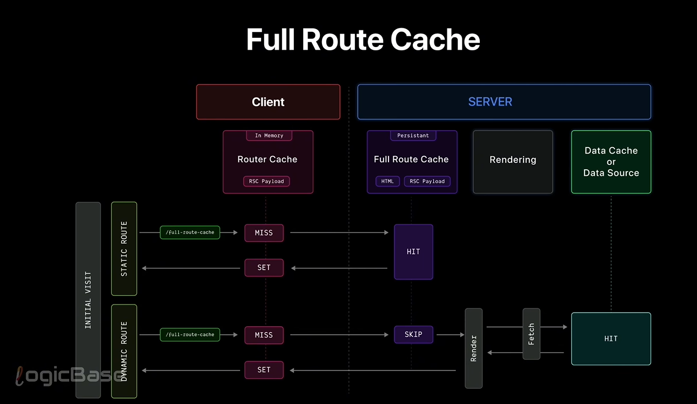

There's just one
[68:42] extra concept we need to know and that
[68:45] is the React server component payload. I
[68:48] hope you remember at the beginning of
[68:49] this video I mentioned that the React
[68:51] server component payload is essentially
[68:53] a process log. When a server component
[68:56] is rendered on the server, it writes
[68:58] down how that rendering happened like a
[69:00] log file. Later, when the same React
[69:03] tree needs to be rendered on the client,
[69:05] Nex.js can use this RSC payload to
[69:07] quickly generate the page on the client
[69:09] side without having to load the entire
[69:12] React library. 

 As you can
[69:18] see, there's a link labeled full root
[69:20] cache. And when you click on it, it
[69:22] opens up a page. There's nothing new
[69:25] here. It's just a regular static page.
[69:27] Now think back for a second. When was
[69:30] the first time we talked about full root
[69:32] cache? We asked a question, does NexJS
[69:35] even need to render the page? Meaning I
[69:38] have entered the server from the client
[69:40] side. Now my job is to render the react
[69:42] tree. But before I even do that, I ask
[69:45] myself, do I even need to render this?
[69:48] Or has some other user already rendered
[69:51] this earlier? or maybe it was
[69:53] pre-rendered at build time. These
[69:56] questions help us understand that full
[69:58] root cache only works in the case of
[70:00] statically built pages. It doesn't work
[70:03] at all for dynamic pages because static
[70:06] rendering is only possible when the page
[70:08] has already been generated beforehand.
[70:10] But if it's a dynamic render, the page
[70:13] is generated from scratch every single
[70:15] time. Meaning the server creates a new
[70:18] page for each request. So in that case
[70:21] the question of whether we need to
[70:23] render doesn't even come up. Simply put
[70:26] full root cache only works for
[70:28] statically generated pages built with
[70:31] NexJS.

if we open the network tab in
[71:06] Chrome Dev Tools, clear all the existing
[71:09] network logs, go to the homepage, and do
[71:12] a hard reload and then navigate back to
[71:14] the full root cache page. You will
[71:16] notice some new logs appearing in the
[71:19] network tab. You will see a log entry
[71:21] named full root cache and then there
[71:24] will be a few more entries like one RSC
[71:28] 2 RSC etc. These logs appear because in
[71:31] nextJS when you use a link component and
[71:33] those links are within the viewport
[71:35] Next.js intelligently preloads those
[71:38] pages from the server in advance. So
[71:40] they are ready even before the user
[71:42] clicks on them. Since the links to the
[71:44] one, two, and three pages were already
[71:46] in the viewport. NextJS preloaded them.
[71:49] But you can ignore those for now. We are
[71:51] not focusing on them at the moment. Now
[71:54] if we click on the full root cache item
[71:56] in the network tab, you will see that
[71:58] its response is actually an RSC payload.
[72:01] In other words, when I visit this page,
[72:03] the server is only sending me this RSC
[72:06] payload file. And using that payload,
[72:08] NexJS is generating the entire React
[72:11] tree on the client side. At the same
[72:13] time, it's using the necessary
[72:15] JavaScript for hydration to fully
[72:17] hydrate the page because that tree is
[72:20] already available and NexJS knows which
[72:22] parts are client components, which ones
[72:24] are server components and how they are
[72:26] connected. So it can generate the full
[72:28] React tree right on the client side. And
[72:31] it's all possible because of this React
[72:34] server component payload. So what we
[72:36] mean by full root cache is this. Whether
[72:39] or not the page will be rendered depends
[72:41] on two things. One is the RSC payload
[72:44] and the other is the static HTML part of
[72:47] the page. When you run the npm run build
[72:49] command, NextJ stores both the HTML of
[72:52] the page and the React server component
[72:54] payload in the server's cache. Then when
[72:58] a user clicks on that page in the
[72:59] production website, only the RSC payload
[73:02] is sent and you get to see the page
[73:04] almost instantly. In this case, the page
[73:07] isn't being rendered again on the server
[73:09] because everything has already been
[73:11] cached ahead of time. And that is what
[73:14] we call full root cache. This was the
[73:17] first layer of caching on the server. If
[73:19] you remember that diagram we saw
[73:20] earlier, you will notice the very first
[73:22] thing that happens on the server is the
[73:24] full root cache. Then comes request
[73:27] memorization which decides whether the
[73:29] page should be rendered. And then comes
[73:31] the data cache where it's decided
[73:33] whether to hit the data source or not.
[73:35] So I hope you can now clearly understand
[73:38] what full root cache is and you have
[73:41] also understood that this only works for
[73:43] static pages.

# How to revalidate and Skip full route catching

Now let's see how we can
[73:46] revalidate this full root cache. Just
[73:48] like we revalidate the data cache, we
[73:50] can revalidate this the same way. If you
[73:53] are able to revalidate the data cache
[73:55] then the full root cache will also get
[73:57] revalidated automatically which means
[73:59] here too you can follow the same
[74:01] strategy on demand revalidation and
[74:03] timebased revalidation. Now the question
[74:06] is if I don't want to use this cache at
[74:08] all, what if I want to opt out of it?
[74:12] The simple answer is you have to make
[74:14] the page dynamic and there are several
[74:16] ways to do that. In nextJS, you can make
[74:19] a page dynamic in different ways. One
[74:21] way is to explicitly convert the page
[74:24] into a dynamic page. If we go to the
[74:26] data cache folder, you will see that we
[74:28] have a dynamic root created using an ID.
[74:31] When such a dynamic route exists, the
[74:33] page becomes server side and naturally
[74:36] the full root cache gets opted out. In
[74:39] the same way, if you want, you can
[74:40] disable full root cache by using any
[74:43] serverside feature of Nex.js. For
[74:45] example, if you use the cookies function
[74:47] in the root, NexJS will automatically
[74:49] assume the page is dynamic because
[74:52] cookies are needed at runtime.
[74:54] Similarly, if you use the headers
[74:56] function, the page will also be treated
[74:58] as dynamic and the full root cache will
[75:00] be opted out. Another way is when you
[75:03] use fetch, you can pass the option cache
[75:06] no store. Using this option makes the
[75:08] request dynamic. So the static cache
[75:11] won't apply anymore. Also, while
[75:14] revalidating, you can use revalidate
[75:16] zero. This means every time a request
[75:19] comes in the page will revalidate which
[75:22] effectively means it will rerender every
[75:25] time. So it becomes a dynamic page in
[75:27] practice. You can even use this
[75:29] revalidation another way. At the top of
[75:32] the page just write export constant
[75:34] revalidate is equal to zero and that's
[75:36] it. This works too. Or even more simply
[75:40] you can just write export constant
[75:42] dynamic is equal to force dynamic on the
[75:44] page. This will force the page to become
[75:47] dynamic and full root cache won't be
[75:49] used anymore. So we can now understand
[75:52] that full root cache is actually very
[75:54] simple and the most important part here
[75:56] is the RSC payload. This cache exists so
[76:00] that nextJS can serve statically
[76:02] generated pages really fast. In other
[76:05] words, this cache is only used for
[76:07] performance upgrade.

full root
[76:15] cache kicks in during two scenarios.
[76:17] When the page is being built at build
[76:19] time or when a revalidation is
[76:21] happening. During the build time, since
[76:24] the page is static, full root cache is
[76:26] used. Again, when you trigger a
[76:28] revalidation, the page is refreshed on
[76:30] the server, meaning it's built again and
[76:33] full root cache is used then too. Now,
[76:36] imagine this, a request comes in for the
[76:38] first time in production. At that
[76:40] moment, there will be nothing inside the
[76:42] full root cache. So it will be a miss.
[76:45] What happens next? If data fetching is
[76:47] required, the app will go to the data
[76:49] source and fetch the data. Then it will
[76:52] generate two things. HTML RSC payload.
[76:56] Both of these will be generated and
[76:58] stored in the cache. Now the next time
[77:00] you visit the same page after that
[77:02] initial visit, the first thing that will
[77:04] try to work is the client side router
[77:06] cache which we will look at in detail
[77:09] very soon. If that results in a miss,
[77:12] then the second step will be a hit on
[77:14] the full root cache and the page will be
[77:16] served quickly from there. This flow
[77:19] only works for static roots. But what if
[77:22] it's a dynamic route? In that case, the
[77:25] client side router cache will miss and
[77:27] then it will completely skip the full
[77:30] root cache because as we already said,
[77:32] full root cache doesn't work for dynamic
[77:34] roots. In this case, the page will be
[77:37] rendered every single time and each time
[77:40] it will freshly fetch the data and
[77:42] generate both the RSC payload and the
[77:44] HTML. But the client side router cache
[77:47] still gets set and it works in both
[77:49] cases. We will see that in a moment.

# Using 3W&3H method:

## 📦 Next.js Caching Strategies

| Strategy              | What                          | Where              | Why                     | How long     | How to refresh | How to cancel                      |
|-----------------------|-------------------------------|----------------------------------------------|--------------|----------------|------------------------------------|
| full Route catch      | Memoize static pages          | localStorage/cust  |serve HTML & RSC fast for| persistent   | revalidation   |  Making the page dynamic           |
|                       | (HTML + RSC payload)          | om storage         |FCP & smooth hydration   | across user  |      or        |                                    |
|                       |                               | server-side        |                         | request      | redeployment   |                                    |
|                       |                               |                    |                         | & restart    |                |                                    |

# Point to remember:

    - Full route cache only works for static pages
    - It uses RSC payload and HTML to serve the page quickly
    - It can be revalidated using time based or on demand revalidation
    - To skip full route cache, make the page dynamic using various methods
    - it's a feature of nextJS , not a feature of React