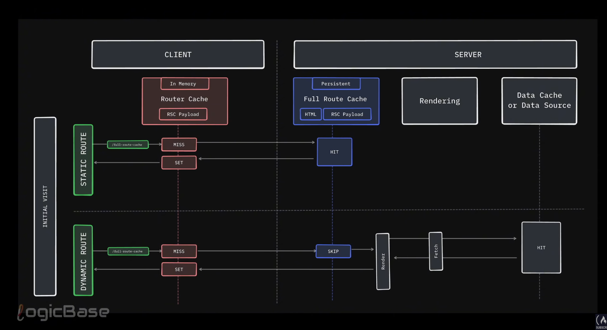

# About prefetch behavior for dynamic pages

If prefetch in  default, a dynamic page will be prefetched if it  in viewport point.
However, when we navigate to that page, it will still fetch the page from the server again.

If we explicitly set prefetch={true} for a dynamic page, it will be prefetched if it in viewport point, 
but during navigation the page will not fetched again from the server.

If we explicitly set prefetch={false} for a dynamic page, it will not be prefetched,
and during navigation the page will be fetched from the server.

# About prefetch behavior for static pages

If prefetch in  default, a static page will be prefetched if it in viewport point.
During navigation to that page, it will not fetch the page from the server again.

If we explicitly set prefetch={true} for a static page, it will be prefetched if it in viewport point,
but during navigation the page will not be fetched again from the server.

If we explicitly set prefetch={false} for a static page, it will not be prefetched,
but during navigation the page will be fetched from the server and second time
it will be comes from cached so it will not fetched from server.
However, there will be a slight delay during navigation as the page is loaded on demand.

# How to configure the cache durations :

By default static is set to 5 minutes or 300 seconds. Dynamic is set to 0 seconds. That's 
the default behavior, but we can change these values if you want using next.config.mjs file. 
Let's say we set static to 10 seconds and dynamic to 5 seconds. Now, if we restart the server 
by running npm run build and npm start and then open the browser, we'll be able to see how easily
we can control the cache durations. So, I go to the homepage and perform a hard reload. then navigate
to the router cache page. Now notice since I left prefetch as default, it automatically starts prefetching.
I click on the static page and as expected there's no network request. Then I go back to the router cache 
page and the dynamic page had already been requested earlier. That's expected. Then I go back to the static 
page again and this time it didn't wait for 5 minutes. As soon as the 10 seconds were over, it fetched the page again
Done. From this point, you are no longer getting the benefit of the router cache for that static page. This feature 
came with NexJS15. And from this point on, every time you visit, the static page will be fetched fresh each time. That 
means on the first visit, you will get the benefit of this feature. And for the dynamic page, since we set the stale 
times to 5 seconds, you will initially get a 5-second stale time. After that, it will start fetching the page again 
on each visit. Now, if you frequently visit a page, NexJS will assume it's no longer keeping it in the router cache.
And that's basically the full control mechanism of Nex.js client side router cache.

# Summary of router-cache behavior for static pages with staleTime 

After the router-cache staleTime expires, static pages are fetched on every navigation

```css

        Click link
        → router cache miss
        → fetch RSC payload from server
        → render page
        → DO NOT keep it cached again

```

### 1️⃣ First visit

    **Prefetch happens**

    **Router cache hit**

    **❌ No network request**

### 2️⃣ Wait 5–10 seconds (staleTime expires)

    **Router cache entry is evicted**

### 3️⃣ Visit static page again

    **Router cache miss**

    **✅ Network request (?_rsc=...)**

    **Page renders**

### 4️⃣ Visit again

    **❌ No re-prefetch**

    **❌ No cache reuse**

    **✅ Network request again**

👉 This repeats forever

# Summary of router-cache behavior for dynamic pages with staleTime

After the router-cache staleTime expires, dynamic pages are prefetched worked as expected

```
# Using 3W&3H method:

| Strategy              | What                          | Where              | Why                     | How long     | How to refresh | How to cancel                      |
|-----------------------|-------------------------------|----------------------------------------------|--------------|----------------|------------------------------------|
| Router Cache          | Memoize route segment         | client side in     | for faster prefetch     | default 5min | revalidate by  |                                    |
|                       |                               | memory inside      | in route navigation     |              | path or tag/   | page segments opted out by default |
|                       |                               | browser            |                         |              | cookie.set/    |                                    |
|                       |                               |                    |                         |              | cookie.delete/ |                                    | 
|                       |                               |                    |                         |              | router.refresh |                                    | 


